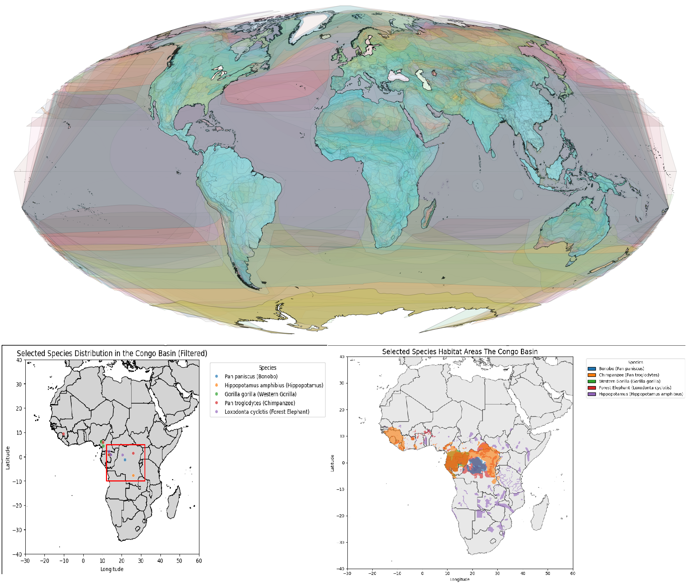

## **Congo Basin Habitat Analysis: Mapping Biodiversity with Geospatial Data**

### **Mapping Biodiversity with Geospatial Data**

**Congo Basin Habitat Analysis**

This project analyzes biodiversity in the Congo Basin using geospatial data, focusing on the habitat distribution of key species such as bonobos, chimpanzees, gorillas, forest elephants, and hippopotamuses. Using Python and libraries such as GeoPandas, Matplotlib, and Contextily, the habitats of these species are visualized on high-resolution maps, utilizing the Mollweide projection for accurate area representation.

#### **Key Features**
- **Data Filtering and Visualization**: Large datasets are efficiently filtered to focus the analysis on relevant species and regions, emphasizing the importance of data preparation for efficient processing.
- **Habitat Mapping**: Species habitats are displayed in distinct colors to highlight ecological patterns and relationships.
- **Actionable Insights**: Demonstrates how efficient data filtering and analysis techniques can contribute to conservation planning and biodiversity research.

[GitHub Repository](https://github.com/TimSahre/Congo_Basin_Analysis/tree/main?tab=readme-ov-file)
