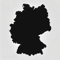

# Various Visualizations for Germany Using Boundary Masks

This project explores different techniques to create unique visualizations constrained by the boundary mask of Germany.

[View Notebook](https://colab.research.google.com/drive/1cTRV19aWN1l-nwperGx57SVPyF0c7LoV#scrollTo=bbl8KXxPlzGM)

## 1. Animated 2D Gaussian Visualization
Dynamic 2D Gaussian functions (bell curves) are displayed within the borders of a mask based on a black-and-white representation of Germany. The Gaussians change their position, width, and amplitude randomly over time, resulting in a vivid, evolving animation. Areas outside the mask are excluded, and the animation is saved as a .gif.

## 2. Filling a Mask with Circles
This visualization fills the shape of Germany with randomly placed colorful circles of fixed size. The circles are positioned within the black areas of the mask without overlapping, creating an aesthetically pleasing result. A predefined color palette enhances the visual effect, and the output is saved as an image.

